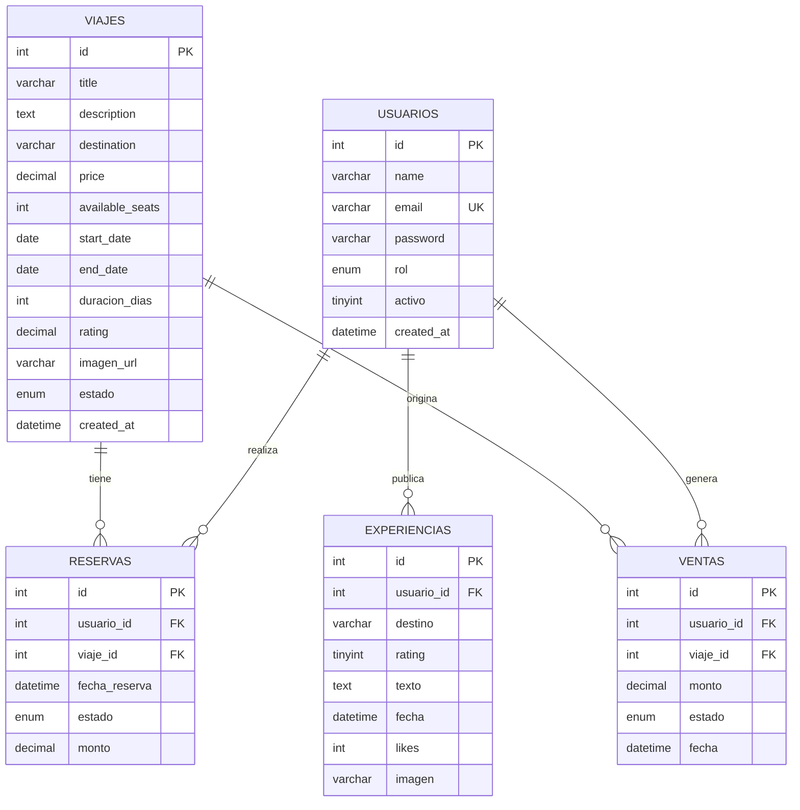
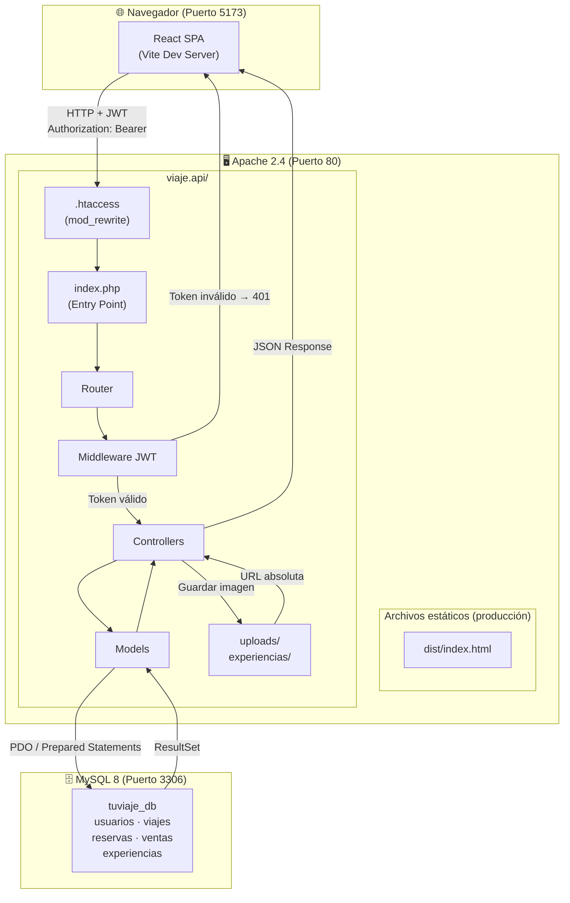
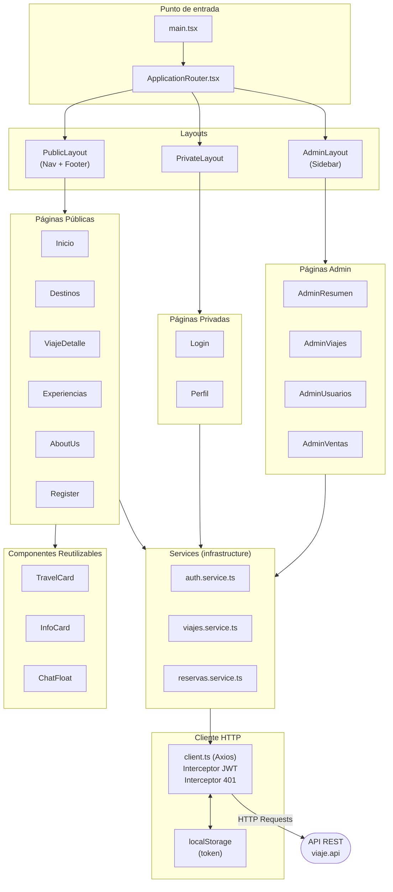
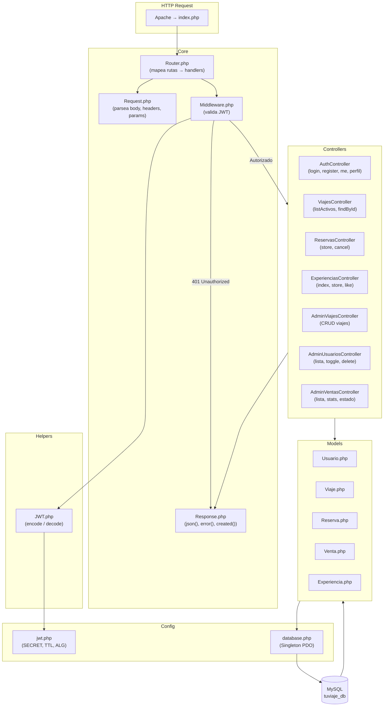
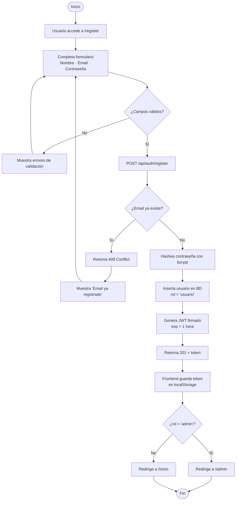
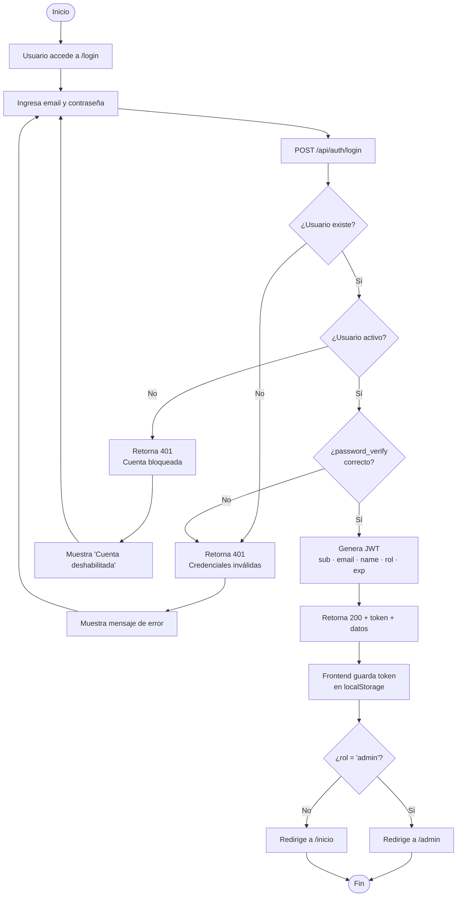
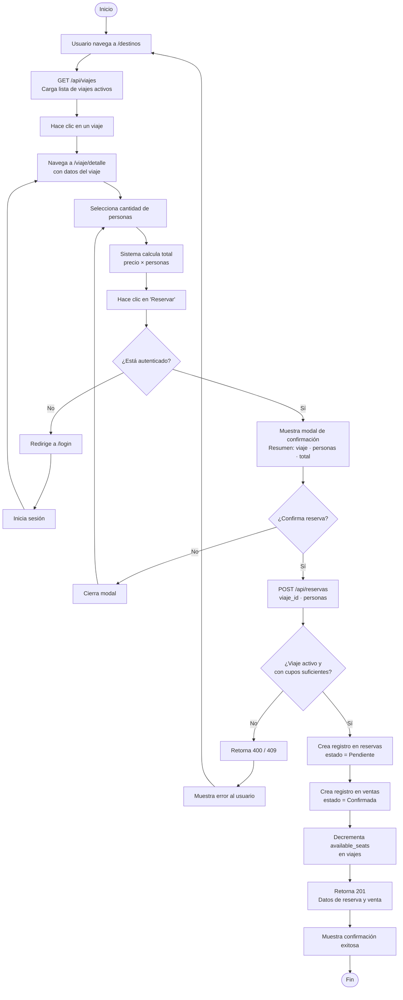
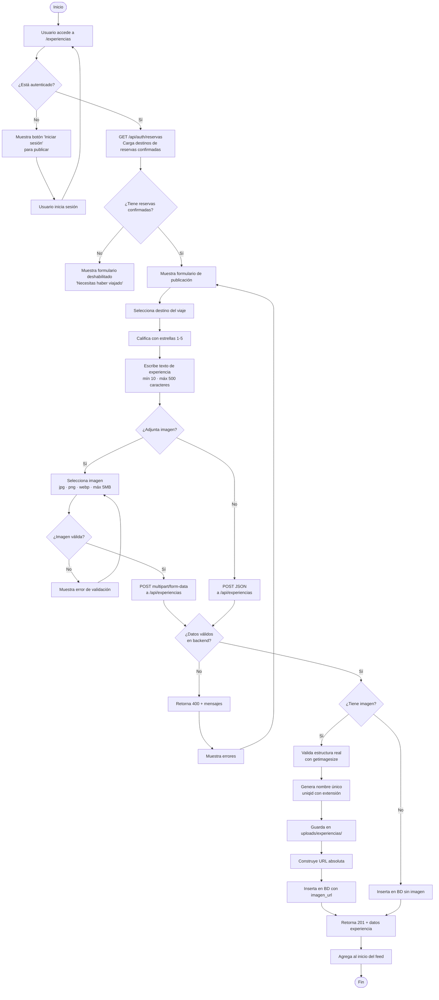
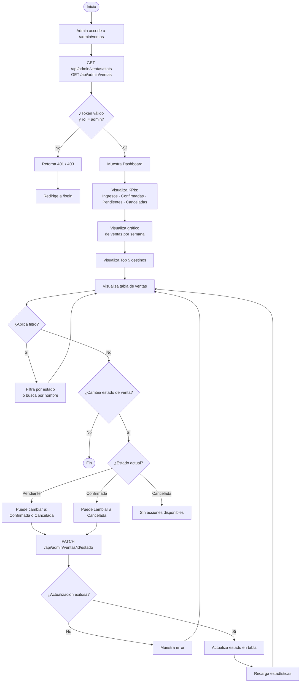
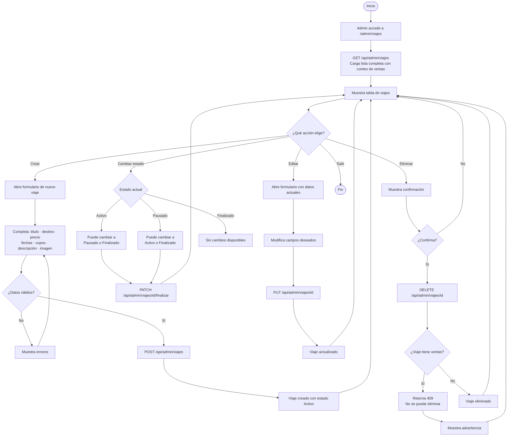

# TuViaje — Diagramas del Sistema

> Todos los diagramas usan sintaxis **Mermaid**. Se renderizan automáticamente en GitHub, GitLab, Obsidian, Notion y la extensión "Markdown Preview Mermaid Support" de VS Code.

---

## Tabla de Contenidos

- [Modelo Entidad-Relación](#modelo-entidad-relación)
- [Diagrama de Componentes — Sistema Completo](#diagrama-de-componentes--sistema-completo)
- [Diagrama de Componentes — Frontend React](#diagrama-de-componentes--frontend-react)
- [Diagrama de Componentes — Backend PHP](#diagrama-de-componentes--backend-php)
- [Diagrama de Actividades — Registro de Usuario](#diagrama-de-actividades--registro-de-usuario)
- [Diagrama de Actividades — Inicio de Sesión](#diagrama-de-actividades--inicio-de-sesión)
- [Diagrama de Actividades — Hacer una Reserva](#diagrama-de-actividades--hacer-una-reserva)
- [Diagrama de Actividades — Publicar una Experiencia](#diagrama-de-actividades--publicar-una-experiencia)
- [Diagrama de Actividades — Administrador Gestiona Ventas](#diagrama-de-actividades--administrador-gestiona-ventas)
- [Diagrama de Actividades — Administrador Gestiona Viajes](#diagrama-de-actividades--administrador-gestiona-viajes)

---

## Modelo Entidad-Relación

---

## Diagrama de Componentes — Sistema Completo

Muestra cómo se comunican las tres capas principales: navegador, servidor web y base de datos.

---

## Diagrama de Componentes — Frontend React

Detalle interno de la SPA: capas, páginas y servicios.

---

## Diagrama de Componentes — Backend PHP

Detalle interno del backend: enrutamiento, middleware, controladores y modelos.

---

## Diagrama de Actividades — Registro de Usuario

---

## Diagrama de Actividades — Inicio de Sesión

---

## Diagrama de Actividades — Hacer una Reserva

---

## Diagrama de Actividades — Publicar una Experiencia

---

## Diagrama de Actividades — Administrador Gestiona Ventas

---

## Diagrama de Actividades — Administrador Gestiona Viajes

