# TuViaje — Diagramas del Sistema

> Todos los diagramas usan sintaxis **Mermaid**. Se renderizan automáticamente en GitHub, GitLab, Obsidian, Notion y la extensión "Markdown Preview Mermaid Support" de VS Code.

---

## Tabla de Contenidos

### Estructura
- [Modelo Entidad-Relación](#modelo-entidad-relación)
- [Diagrama de Componentes — Sistema Completo](#diagrama-de-componentes--sistema-completo)
- [Diagrama de Componentes — Frontend React](#diagrama-de-componentes--frontend-react)
- [Diagrama de Componentes — Backend PHP](#diagrama-de-componentes--backend-php)

### Flujos de actividad
- [Registro de Usuario](#diagrama-de-actividades--registro-de-usuario)
- [Inicio de Sesión](#diagrama-de-actividades--inicio-de-sesión)
- [Pago de Reserva con Stripe](#diagrama-de-actividades--pago-de-reserva-con-stripe)
- [Cancelación con Refund Automático](#diagrama-de-actividades--cancelación-con-refund-automático)
- [Recuperación de Contraseña](#diagrama-de-actividades--recuperación-de-contraseña)
- [Publicar / Editar una Experiencia](#diagrama-de-actividades--publicar--editar-una-experiencia)
- [Administrador Gestiona Ventas](#diagrama-de-actividades--administrador-gestiona-ventas)
- [Administrador Gestiona Viajes](#diagrama-de-actividades--administrador-gestiona-viajes)
- [Refund desde el Panel Admin](#diagrama-de-actividades--refund-desde-el-panel-admin)
- [Cleanup Automático de Pendientes](#diagrama-de-actividades--cleanup-automático-de-pendientes)

---

## Modelo Entidad-Relación

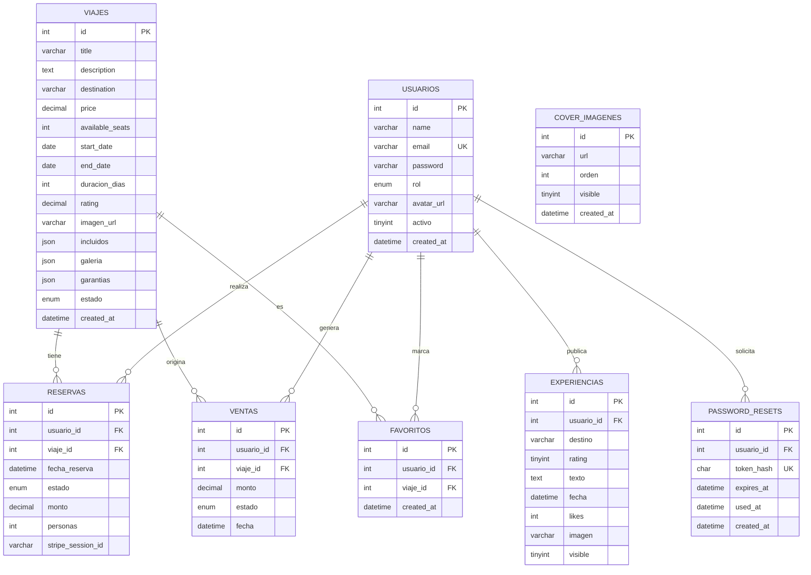

---

## Diagrama de Componentes — Sistema Completo

Muestra cómo conviven el navegador, el servidor web, la base de datos y los servicios externos (Stripe, SMTP) y los jobs CLI.

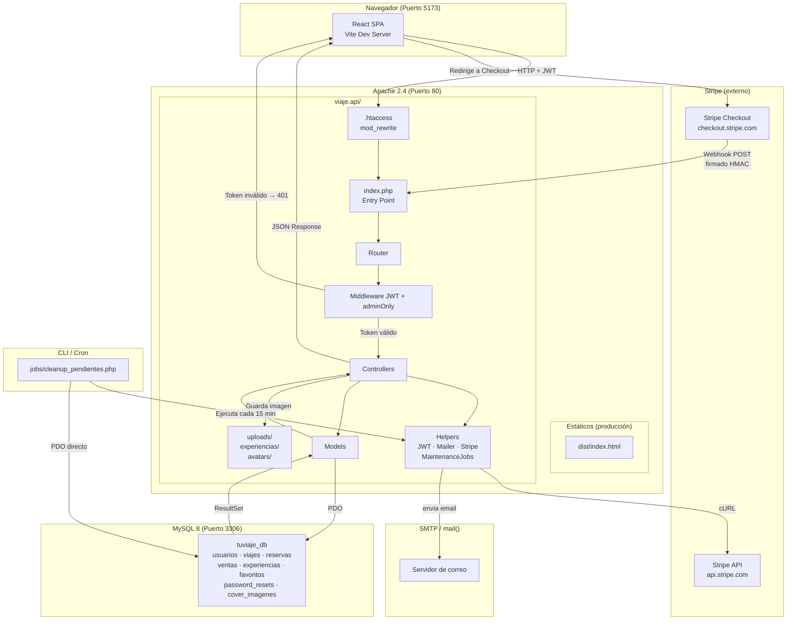

---

## Diagrama de Componentes — Frontend React

Detalle interno de la SPA: layouts, páginas, servicios y AuthContext.

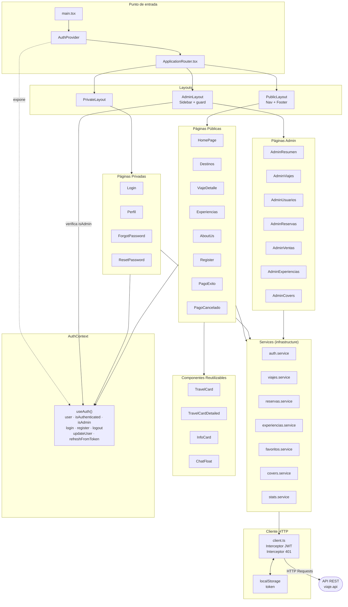

---

## Diagrama de Componentes — Backend PHP

Detalle interno: enrutamiento, middleware, controladores, modelos, helpers y jobs CLI.

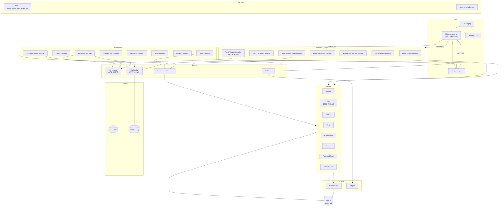

---

## Diagrama de Actividades — Registro de Usuario

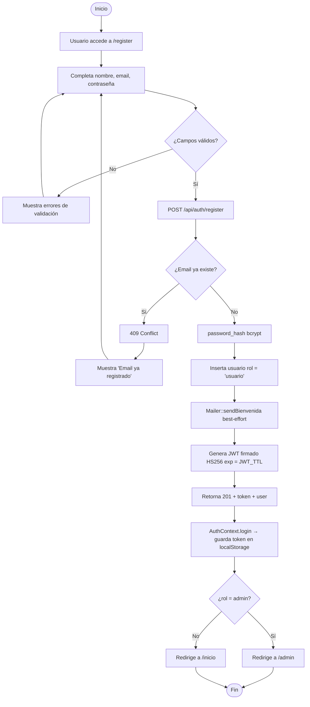

---

## Diagrama de Actividades — Inicio de Sesión

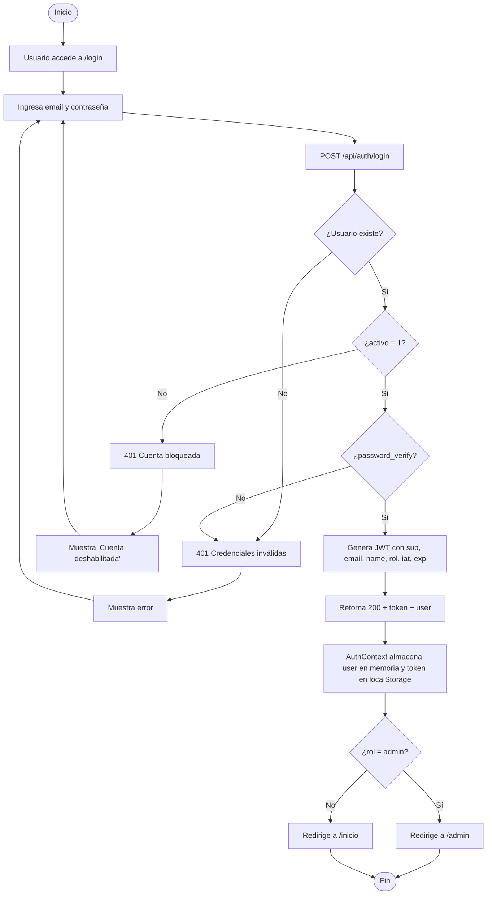

---

## Diagrama de Actividades — Pago de Reserva con Stripe

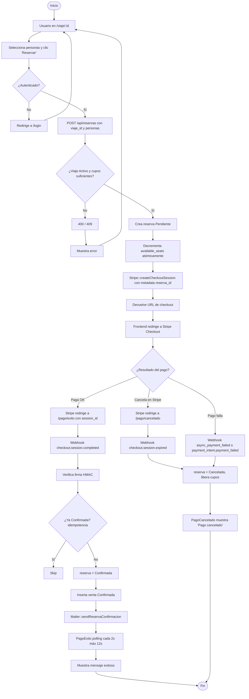

---

## Diagrama de Actividades — Cancelación con Refund Automático

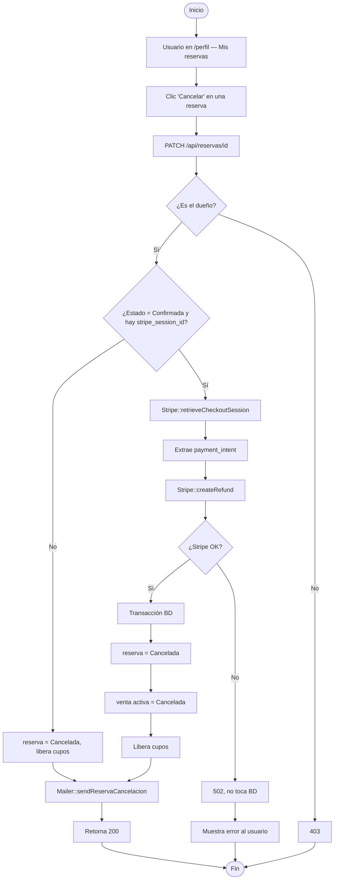

---

## Diagrama de Actividades — Recuperación de Contraseña

```mermaid
flowchart TD
    A([Inicio]) --> B[Usuario en /login clic 'Olvidé contraseña']
    B --> C[/forgot-password ingresa email]
    C --> D[POST /api/auth/forgot-password]
    D --> E{¿Usuario existe?}
    E -- No --> F[Responde 200 genérico anti-enum]
    F --> Z1([Fin sin email])
    E -- Sí --> G[Genera token aleatorio 64 hex]
    G --> H[Guarda SHA-256 del token + expires_at now + 1h]
    H --> I[Mailer::sendPasswordReset con link APP_URL/reset-password/token]
    I --> J[Responde 200]
    J --> K[Usuario abre email]
    K --> L[/reset-password/:token]
    L --> M[Ingresa nueva contraseña]
    M --> N[POST /api/auth/reset-password con token y password]
    N --> O[Backend hashea token y busca en BD]
    O --> P{¿Existe, no usado, no expirado?}
    P -- No --> Q[400 'Token inválido o expirado']
    Q --> R[Muestra error]
    P -- Sí --> S[password_hash y UPDATE usuario]
    S --> T[Marca used_at = now]
    T --> U[Responde 200]
    U --> V[Redirige a /login]
    V --> W([Fin])
    R --> W
```

---

## Diagrama de Actividades — Publicar / Editar una Experiencia

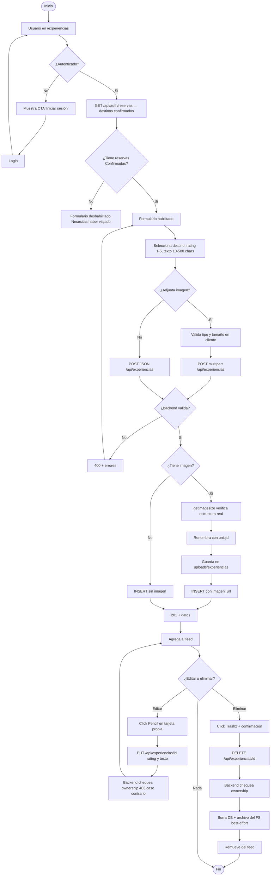

---

## Diagrama de Actividades — Administrador Gestiona Ventas

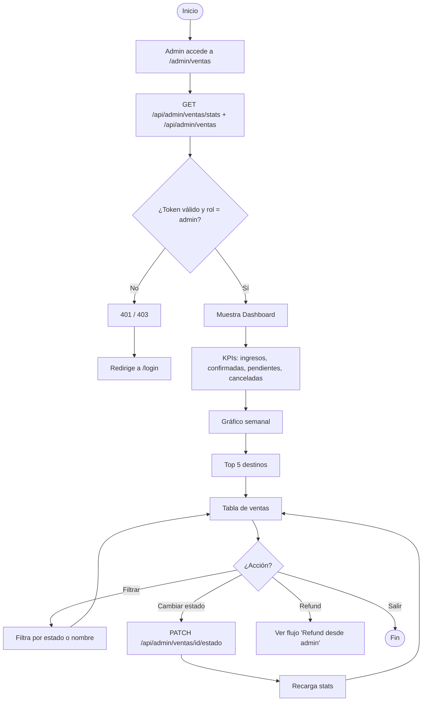

---

## Diagrama de Actividades — Administrador Gestiona Viajes

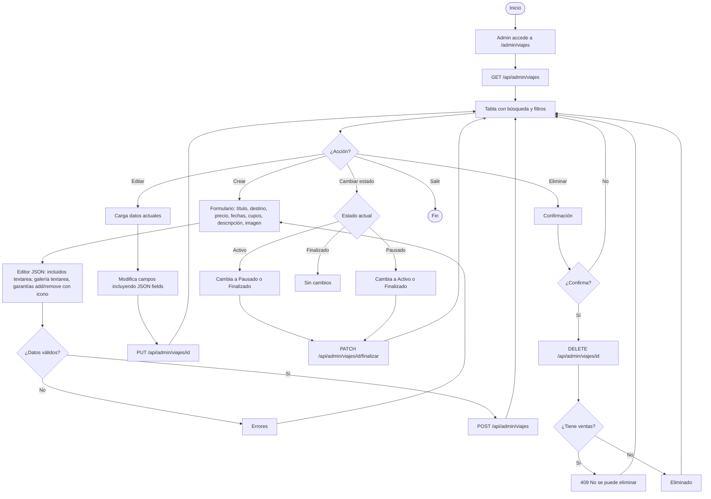

---

## Diagrama de Actividades — Refund desde el Panel Admin

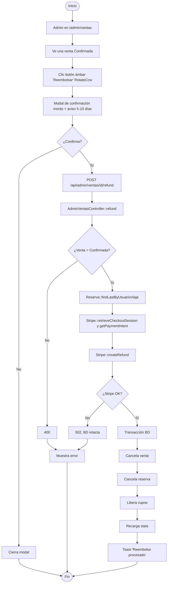

---

## Diagrama de Actividades — Cleanup Automático de Pendientes

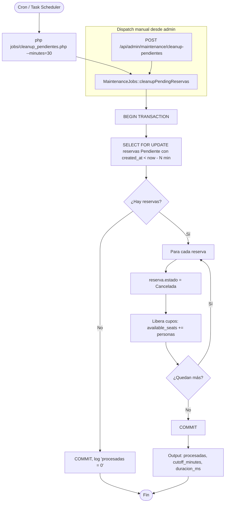

---

*Diagramas actualizados el 15 de mayo de 2026.*
