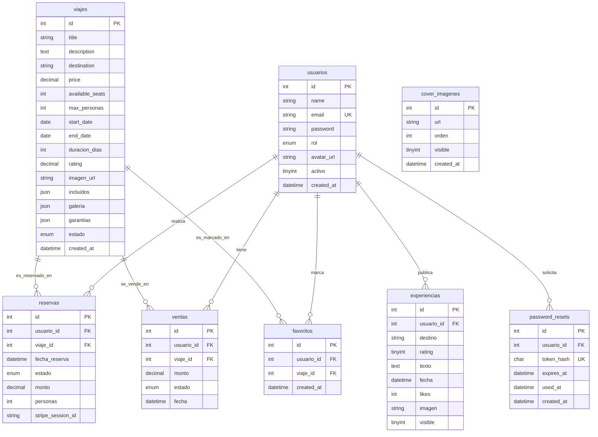

# Modelo Entidad-Relación - TuViaje

Este documento describe la estructura y relaciones de la base de datos de la plataforma **TuViaje**.

A continuación se presenta el diagrama de Entidad-Relación en formato **Mermaid**. Puedes visualizarlo directamente en lectores compatibles con Markdown (como GitHub, VS Code con extensiones, etc.).

## Descripción de las Entidades

### 1. Usuarios (`usuarios`)
Representa a los clientes y administradores de la plataforma.
- `id`: Identificador único autoincrementable.
- `rol`: Define los privilegios (`usuario` o `admin`).
- `activo`: Estado de habilitación de la cuenta.

### 2. Viajes (`viajes`)
Contiene la información de los paquetes turísticos ofrecidos.
- `max_personas`: Límite configurable de plazas reservables por compra.
- `incluidos`, `galeria`, `garantias`: Campos tipo `JSON` para flexibilidad de contenido dinámico.
- `estado`: `Activo`, `Pausado` o `Finalizado`.

### 3. Reservas (`reservas`)
Almacena el intento/solicitud de compra de un viaje. Nace en estado `Pendiente` y se vincula con la pasarela de pagos.
- `stripe_session_id`: Identificador de sesión para confirmación de Stripe Checkout.
- `personas`: Cantidad de cupos apartados en esta transacción.

### 4. Ventas (`ventas`)
Registra las transacciones comerciales confirmadas y consolidadas.
- `monto`: Importe total cobrado.
- `estado`: Refleja si el cobro se mantiene (`Confirmada`), falló (`Pendiente`) o fue devuelto (`Cancelada`).

### 5. Experiencias (`experiencias`)
Opiniones y reseñas públicas escritas por los usuarios tras sus viajes.
- `visible`: Flag de moderación para administradores.

### 6. Cover Imágenes (`cover_imagenes`)
Galería administrable para el Hero Slider/Carrusel principal en la página pública.

### 7. Favoritos (`favoritos`)
Relación de muchos a muchos que guarda la lista de deseos de cada usuario.

### 8. Restablecimiento de Contraseñas (`password_resets`)
Tokens con expiración temporal para el flujo de recuperación de accesos.
